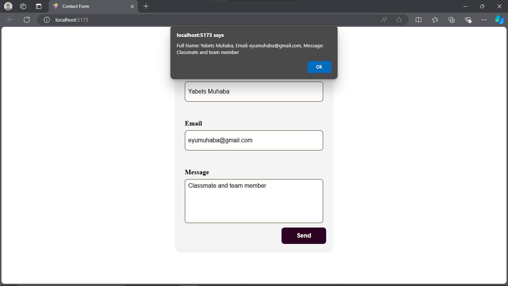

### Contact Form Application

**Overview**

The Contact Form Application is a straightforward React-based web app that enables users to submit their contact details, including name, email, and a message. It leverages the `react-hook-form` library to manage form state and validation, ensuring a seamless user experience. The form performs client-side validation, providing instant feedback if any fields are missing or if the email format is incorrect.

**Key Features**

- **Form State Management:** Efficiently handles form state with `react-hook-form`.
- **Client-Side Validation:** Offers real-time feedback for required fields and correct email formatting.
- **Responsive Design:** Uses Tailwind CSS for a responsive and visually appealing interface.
- **Developer Tools:** Integrates `@hookform/devtools` for easy debugging during development.

**Technologies Used**

- **React:** JavaScript library for building user interfaces.
- **react-hook-form:** Library for managing form state and validation in React.
- **Tailwind CSS:** Utility-first CSS framework for styling.
- **@hookform/devtools:** Tools for debugging `react-hook-form`.

**Getting Started**

**Prerequisites**

- Ensure Node.js and npm are installed on your machine.

**Installation**

1. **Clone the repository:**

   ```bash
   git clone  https://github.com/JABEZ8650/A2SV-project.git
   ```

2. **Navigate to the parent directory:**

   ```bash
   cd A2SV-project
   ```

3. **Navigate to the project directory:**

   ```bash
   cd Contact-Form
   ```

4. **Install the dependencies:**
   ```bash
   npm install
   ```

**Running the Application**

1. **Start the development server:**

   ```bash
   npm run dev
   ```

2. **View the application:**
   Open your browser and navigate to `http://localhost:5173` to see the application in action.

**Usage**

- Fill in the contact form with your name, email, and message.
- Click the "Submit" button to send your details.
- Validation messages will appear if required fields are missing or the email format is incorrect.

**Demo**

# Contact Form

## Blank page


## Add Name


## Add Email


## Full Form


## Name Error


## Email Error


## Message Error


# Submittion


