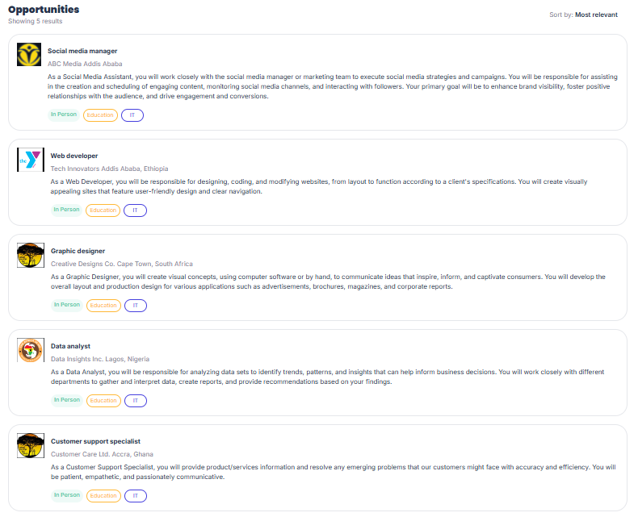

# Job Listing App

**Description**
The Job Listing App is a web application that helps users discover and apply for job opportunities. It offers an intuitive interface for browsing job listings and accessing detailed information about each position.

**Features**
- **Responsive Design:** The app is fully responsive, ensuring seamless performance across all devices.
- **Job Details:** Users can view comprehensive information about each job, including the job description, requirements, and company details.

**Setup and Installation**

1. **Clone the repository:**
   ```bash
   git clone https://github.com/jabez8650/A2SV-project.git
   cd job-listing-app
   ```

2. **Install dependencies:**
   ```bash
   npm install
   ```

3. **Run the application:**
   ```bash
   npm run dev
   ```

4. **Open your browser and navigate to** `http://localhost:3000` **to view the app.**

# **Demo**

## JobCard-UI


## Job List


## Description
