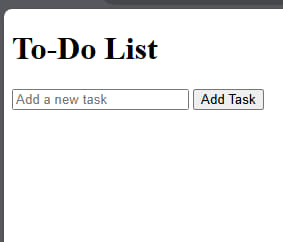
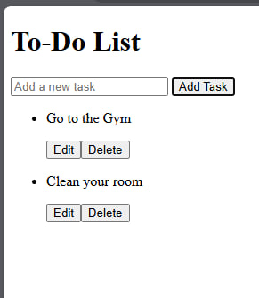
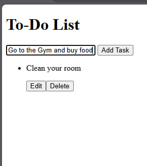
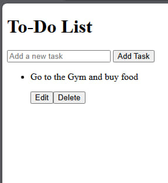

# To-Do List
## JavaScript

## Type and add your task

## Tasks you added would be listed

## When you click "edit" you can edit that specific task

## When you click "delete" that specific task would be deleted

