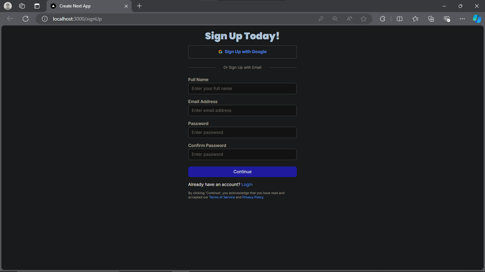
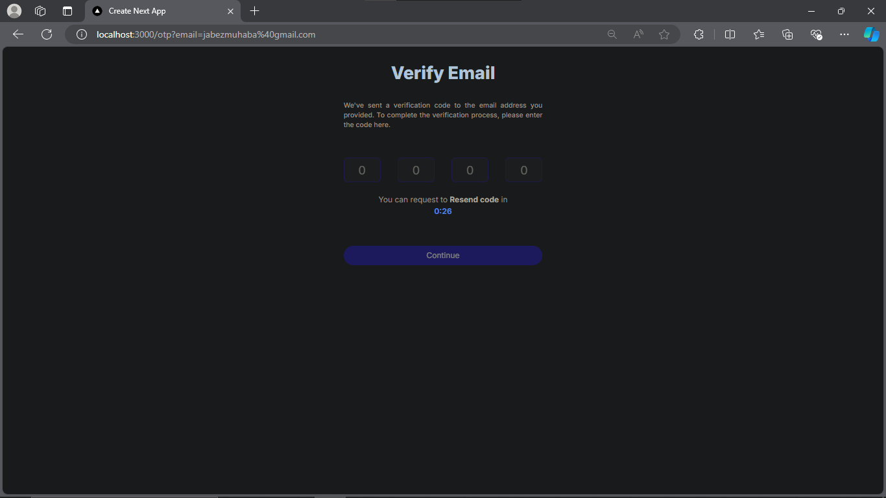
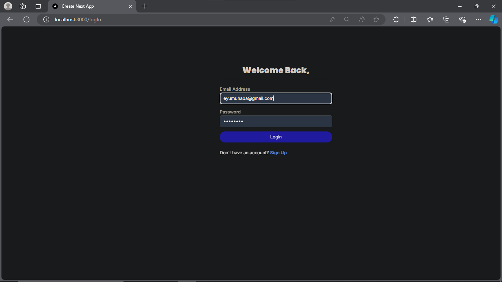
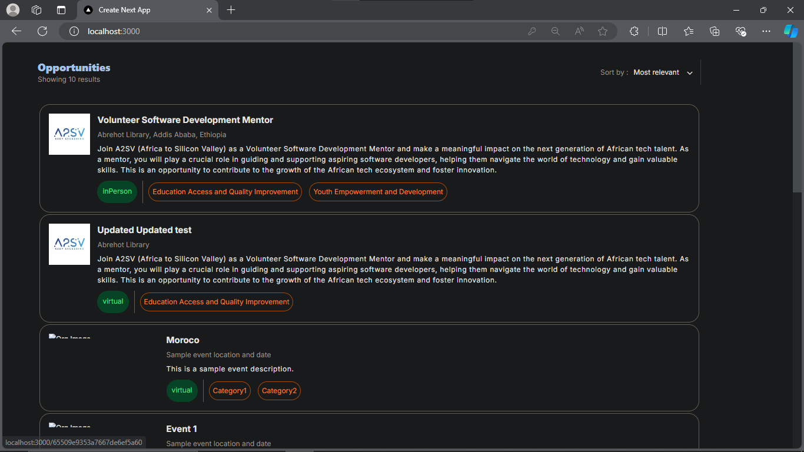
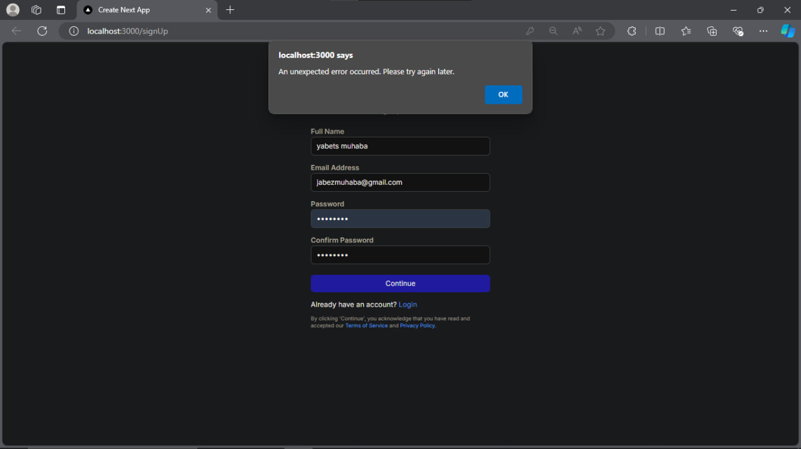

# Next Auth

### Features

This application offers a comprehensive user authentication system, ensuring secure and seamless access for users.

**Effortless Signup:** Users can easily create an account by providing their name, email, and password, or by using an OAuth provider. The system enforces strong password policies, performs input validation, and requires email verification to enhance account security.

**Secure Sign-In:** Registered users can log in securely with their email and password. The application interacts with the backend API to verify credentials and issue access tokens upon successful authentication.

**API Integration:** The application is fully integrated with a backend API for user authentication, utilizing specific endpoints to manage signup and sign-in processes while ensuring the security and integrity of user data.

### Backend Integration

The application communicates with the backend API using the following endpoints:

- **Base URL:** [SECRET 🤗]
- **Signup:** `/signup` (POST)
- **Email Verification:** `/verify-email` (POST)
- **Sign-In:** `/login` (POST)

### Key Highlights

- **User-Friendly Interface:** The signup and sign-in pages are designed with a focus on usability and accessibility, offering a smooth and intuitive user experience.
- **Robust Security:** The application implements industry best practices for password management, secure data transmission, and authentication protocols.
- **Comprehensive Error Handling:** The system provides detailed feedback during the signup and sign-in processes, enhancing the overall user experience by handling errors effectively.

# pages

## Sign Up

## OTP Verification

## Sign In

## Dashboard

## invalid

