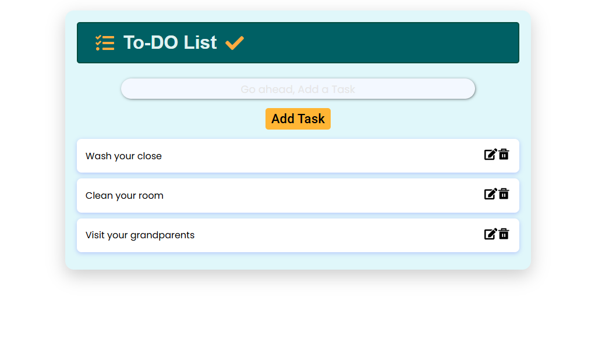
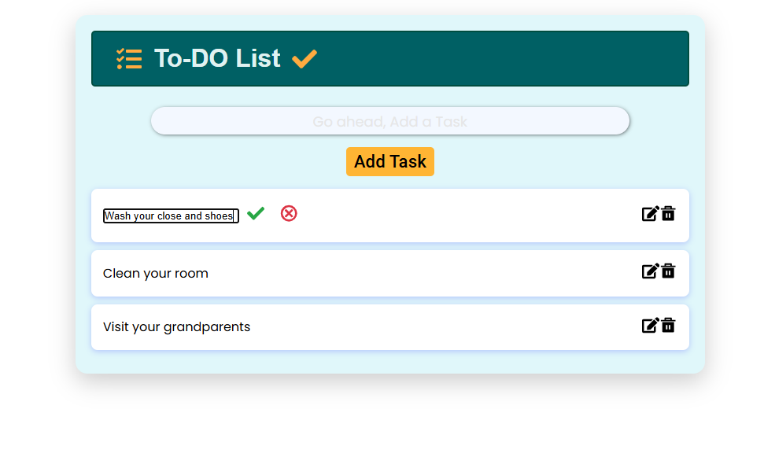
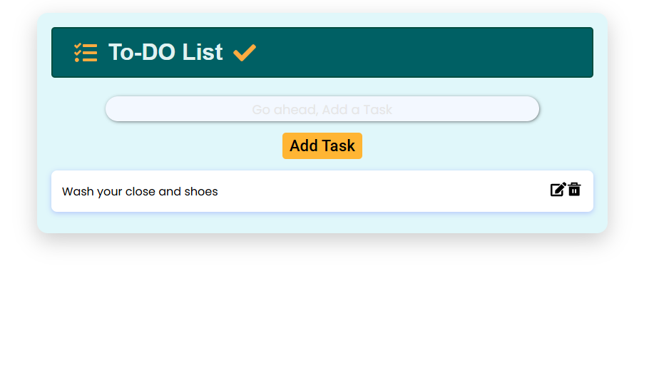

# Todo-List

## React + TypeScript + Vite


## Add



## Edit



## Delete



---

## Simple To-Do List Web Application

This To-Do List web app is built using React.js and TypeScript. It allows users to manage their tasks by adding, deleting, and editing them. Users can also choose to save or discard changes while editing tasks. The app utilizes local storage, ensuring that tasks persist even after the browser is closed or refreshed. When a task is added, it is immediately stored in local storage, making it available even after the page is reloaded.

### Features

- **Add Tasks**: Easily add new tasks to your list.
- **Delete Tasks**: Remove tasks from the list with a single click.
- **Edit Tasks**: Modify existing tasks, with options to save or cancel changes.
- **Persistent Storage**: Tasks are saved in local storage, ensuring they remain even after a browser refresh or closure.

### Local Storage

The app leverages the browser’s local storage to save tasks. This means your tasks will be preserved even if you close the browser or refresh the page.

### Instructions

#### Running the App Locally

1. **Clone the Repository**:
   ```bash
   git clone https://github.com/your-username/to-do-list-react.git
   cd to_do-list-react
   ```
2. **Open the Project**: Open the project folder in VS Code or any other code editor.
3. **Run the App**: Open `index.html` with Live Server or any other tool that supports live preview.

#### How to Use

- **Add a Task**:
  1. Enter your task in the input field.
  2. Click the "Add Task" button or press Enter to add it to the list.
- **Delete a Task**:

  1. Click the "Delete" button next to the task you wish to remove.

- **Edit a Task**:

  1. Click the "Edit" button next to the task you want to modify.
  2. Update the task in the input field and press Enter to save the changes.
  3. You can choose to save your changes or cancel them, leaving the task unchanged.

- **View Tasks**:
  1. To see your saved tasks, simply reload the page.

---

This version streamlines the content, making it clear and easy to follow.
